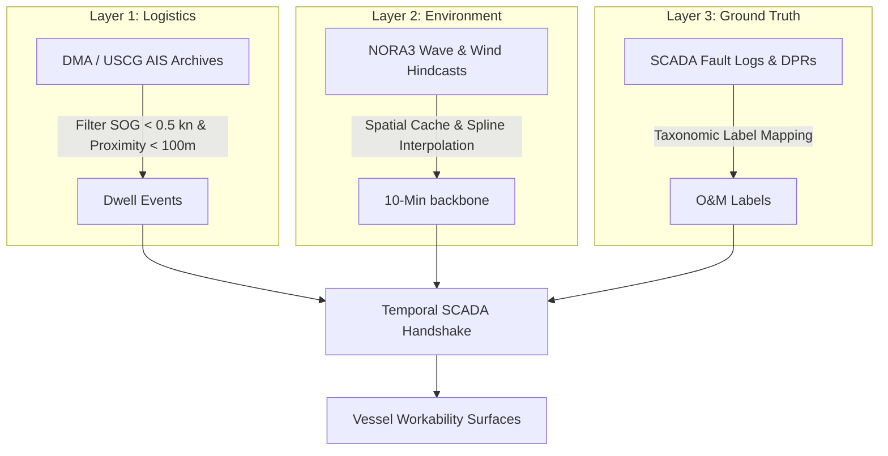

# **Data Acquisition Strategy for Multi-Parameter Operational Limits in Offshore Wind Operations and Maintenance**

This document establishes the empirical data acquisition strategy and pipeline architecture to derive operational limits and workability surfaces for offshore wind Operations and Maintenance (O&M) vessels. It consolidates legacy reports, unstructured Daily Progress Reports (DPRs), and structured academic/commercial databases into a unified, three-layer data pipeline framework, optimizing workability models (such as for Crew Transfer Vessels (CTVs) and Service Operation Vessels (SOVs)).

---

## **1. The Architecture of the Empirical Data Pipeline**

A critical bottleneck in training predictive machine learning models for vessel workability is the absence of ground-truth operational labels (e.g., classifying "Active Maintenance Success" vs. "Wait-on-Weather" (WoW)). Proprietary restrictions typically barricade access to empirical Supervisory Control and Data Acquisition (SCADA) fault logs and Daily Progress Reports (DPRs), forcing models to rely on rigid static thresholds (e.g., a simple significant wave height cutoff of 1.5 meters).

To resolve this, our empirical data pipeline establishes a common spatiotemporal indexing structure to fuse three disparate data streams:
1.  **Vessel Navigation Data (Logistics Layer):** Irregularly logged AIS data capturing vessel kinematics.
2.  **Metocean Hindcasts (Environment Layer):** Fixed-interval atmospheric and wave spectral data.
3.  **SCADA & Event Log Data (Ground-Truth Layer):** Turbine-level state classifications and progress logs.



### **Spatiotemporal Alignment on the 10-Minute Backbone**
-   **Dynamic Positioning Isolation:** When an SOV or CTV approaches a turbine foundation for a transfer, its Speed Over Ground (SOG) drops below 0.5 knots for a duration $\ge$ 15 minutes within a 100-meter radius of the turbine coordinates.
-   **Temporal Upscaling & Interpolation:** Because metocean hindcasts (NORA3) are generated at fixed hourly intervals and AIS data is logged dynamically, we upscale metocean data to a rigid 10-minute backbone:
    -   *Scalar Parameters (Hs, Tp, Wind Speed):* Aligned using **Cubic Spline Interpolation** to capture high-frequency wave spectral transitions.
    -   *Angular Parameters (Wave/Wind/Current Directions):* Aligned using **Circular Vector Interpolation** to ensure continuity and enforce $[0^\circ, 360^\circ)$ boundary bounds.
-   **Tidal Fallback:** For current velocity maps, a physically consistent **semi-diurnal tidal rotation climatology fallback** is applied when offline or CMEMS credentials are not supplied.

---

## **2. Layer 1: Historical AIS Vessel Tracking (The Logistics Layer)**

The foundational layer tracks the O&M fleet kinematics. The strategy targets open-source governmental and institutional maritime databases that distribute raw, bulk terrestrial and satellite AIS data, bypassing commercial API limits.

### **2.1. The Danish Maritime Authority (DMA) AIS Archive**
-   **Coverage:** Extends across Danish coastal waters, the Kattegat strait, the Baltic Sea, and substantial overlaps into the German Bight and broader North Sea. Data is continuously archived from 2006 to the present.
-   **Scale:** Daily uncompressed files represent ~2 GB (~10 million location records), compounding to nearly 700 GB (~3 billion points) per year.
-   **Integration:** High fidelity. The synonym-based header resolver handles multi-year schema variations (e.g., `Latitude`, `Longitude`, `SOG`) and accommodates European comma decimal delimiters.

### **2.2. United States Coast Guard & MarineCadastre Nationwide AIS**
-   **Coverage:** Complete coverage of the US Exclusive Economic Zone (EEZ), critical for emerging offshore wind clusters on the Atlantic Coast.
-   **Scrubbing & Resampling:** Meticulously processed and pre-filtered to a standard **1-minute temporal resolution**, resolving anomalous encryption artifacts and reducing computational load while retaining enough granularity to detect transition piece docking maneuvers.

### **2.3. The Norwegian Coastal Administration (Kystverket) Network**
-   **Coverage:** The Norwegian Sea, North Sea, and Arctic coastal waters.
-   **Availability:** CSV files distributed on a month-by-month basis via dedicated FTP directories. 

---

## **3. Layer 2: High-Resolution Metocean Hindcasts (The Environment Layer)**

Deriving accurate vessel workability requires pairing logistical records with historical, localized wave, wind, and current conditions.

### **3.1. The NORA3 Nonhydrostatic Hindcast**
-   **Source:** MET Norway's THREDDS server.
-   **Specification:** A high-resolution, nonhydrostatic atmospheric and wave hindcast model running at a **3 km grid spacing**, calibrated specifically for the North Sea, Baltic Sea, and Norwegian Sea.
-   **Ingestion Optimization:**
    -   *Wind Variables:* Retrieves hourly wind speed and wind direction at height dimensions of `10` and `100` meters hub height (targeting dataset `nora3_subset_atmos/wind_hourly_v2`).
    -   *Wave Variables:* Pulls significant wave height (`hs`), peak wave period (`tp`), and wave direction (`wave_direction`).
    -   *Spatial Caching:* Wave and wind coordinates are rounded to 2 decimal places and cached on a month-level basis. This allows close-proximity turbines within the same farm to share cached metocean files, eliminating redundant HTTP calls.

### **3.2. FINO In-Situ Research Platforms (1, 2, and 3)**
-   **Coverage:** German Bight and Baltic Sea (FINO1 located near Alpha Ventus; FINO2 near Baltic 1; FINO3 in the North Sea near DanTysk).
-   **Role:** Serves as the ultimate ground-truth baseline for wave spectral shapes, directional spreading, and boundary-layer wind profiles to validate NORA3 and CMEMS currents.

### **3.3. Cefas WaveNet & EMODnet Physics**
-   **Coverage:** UK Continental Shelf and broader European seas.
-   **Role:** Integrates real-time and historical buoy networks (e.g., Waverider buoys), providing high-frequency spectral data ($H_s, T_z, T_p$) to cross-examine shallow-water shoaling effects near coastal arrays.

---

## **4. Layer 3: SCADA, Maintenance Logs, and Ground-Truth Demand**

This layer maps raw vessel dwell events to actual turbine operational states, transforming kinematics into labeled workability matrices.

```
       AIS Dwell Event                  SCADA State Lookup              OM Label
   [ SOG < 0.5 kn, >15m ]   =======>   [ Status Mode = 3 ]   =======>   "Success"
   [ Proximity < 100m   ]              [ (Service Mode)  ]
```

### **4.1. Academic SCADA Status Datasets (Zenodo/Figshare)**

#### **The CAREtoCompare SCADA Status Dataset (Zenodo)**
Published by EDP, this anonymized SCADA and event log dataset provides longitudinal turbine-level performance records across multiple wind farms:

-   **Wind Farm B (De-Anonymized & Verified):**
    -   *Geographical Match:* **Alpha Ventus** (54.011N, 6.607E), comprising 6 REpower/Senvion 5M assets.
    -   *Temporal Alignment:* **0-year shift (Shift = 0)**. Historical SCADA timestamps match real calendar dates exactly (February 2022 to February 2023), exhibiting a Pearson wind correlation of $R \approx 0.93$.
-   **Wind Farm C (De-Anonymized & Production-Mapped):**
    -   *Geographical Match:* **Trianel Windpark Borkum I & II** (centroid 54.05N, 6.46E), comprising the mixed Borkum I/Borkum II turbine fleet.
    -   *Temporal Alignment:* **0-year shift (Shift = 0)**. CAREtoCompare timestamps map directly to the true 2022-2024 operating calendar.
    -   *Evidence Status:* The eight-test validation campaign supports production O&M labeling and metocean integration. AIS/SCADA co-occurrence remains inconclusive because of local AIS coverage gaps and is tracked as an archived validation enhancement, not a blocker.

#### **Other Academic baselines:**
-   **UWiSE Egmond aan Zee Campaign:** Includes 2 years of daily transit logs, vessel dimensions, and wave conditions for the Dutch NoordzeeWind farm (36 Vestas V90-3MW turbines), serving as the foundational validator for early CTV workability simulations.
-   **Lillgrund Reliability Dataset:** A complete SCADA and fault log database for the Lillgrund wind farm (48 Siemens 2.3MW turbines), providing detailed downtime distributions for mechanical subsystem failures.
-   **Trianel Windpark Borkum II Kinematic Proxies:** Dedicated kinematic data packages outlining motion-compensated gangway coordinates and high-frequency vessel acceleration profiles, which map dynamic response metrics directly to significant wave height bounds.

### **4.2. Unstructured Progress Logs (UK Marine Data Exchange)**
The UK Marine Data Exchange (MDE) curated by The Crown Estate contains post-construction survey archives. Daily Progress Reports (DPRs) and transit logs can be text-mined using NLP (e.g., TF-IDF or BERT) to extract weather delay timestamps and weather standbys.

-   **The Dudgeon 2022 Asset Integrity Survey (MDE Ref: TCE-3687):**
    -   *Vessel:* Reach Subsea and XOCEAN survey vessel campaigns overlapping with modern NORA3 hindcast models (July 31 to October 16, 2022).
    -   *Data:* Includes a dedicated `Daily Progress Reports` sub-folder logging midnight-to-midnight vessel activities, equipment calibrations, and Wait-on-Weather standbys.
-   **Sheringham Shoal (MDE Ref: 14/J/1/02/2467/1711):** Contains transit route coordinates and duration logs between the offshore array and the Wells-next-the-Sea harbor, detailing CTV transit speed degradation under adverse waves.
-   **Ormonde & Legacy Arrays (MDE Ref: 13/J/1/02/1684):** Vattenfall's Ormonde survey records detail Hazard Identification and Risk Assessments (HIRA) alongside Daily Progress Reports for the survey vessel "Otarie."

### **4.3. In-Situ Demonstration Turbines: The ORE Catapult POD**
-   **Target Asset:** The Levenmouth Demonstration Turbine (LDT), a 7 MW Samsung heavy-industries turbine located 16 meters offshore in the Firth of Forth.
-   **Dataset Architecture:** The Platform for Operational Data (POD) provides continuous 1s and 10-minute SCADA parameters alongside structural load sensors (blade pitch, tower accelerations).
-   **Fault Classification:** Standardized event logs categorize dispatches into scheduled maintenance, electrical faults, and weather standbys, mapping directly to regional wave buoy measurements.

---

## **5. Commercial Partnerships and NDA Strategies**

Where open datasets exhibit gaps, commercial collaborations provide the ultimate high-fidelity data layers.

### **5.1. Commercial Open Innovation & Research Databases**
-   **Ørsted's University Partnership Programme:** Offers structured access to selected historical SCADA and daily progress reports for Danish and UK offshore assets, subject to academic research agreements.
-   **The AWAKEN Field Campaign:** An international collaborative database logging multi-sensor turbine wake, atmospheric, and mechanical response profiles, providing a benchmark for spatial wind speed degradation inside dense offshore arrays.

### **5.2. Navigating the Non-Disclosure Agreement (NDA) Process**
To unlock proprietary developer data, researchers should structure request arguments around mutual value:
1.  **Anonymization Assurances:** Propose coordinate roundings, year-shifting (preserving seasonal and high-frequency structures), and turbine pseudonymization to protect commercial interest.
2.  **Safety & Operational Optimizations:** Demonstrate how dynamic vessel workability surfaces reduce offshore transit risk and optimize CTV/SOV charter costs, translating raw logs into direct developer fuel savings.

---

## **6. Strategic Synthesis & Integrated O&M Modeling**

By fusing Layer 1 (Kinematic AIS tracks), Layer 2 (Cubic-interpolated NORA3 wave heights and wind profiles), and Layer 3 (Empirical SCADA and unstructured progress labels), modelers can construct advanced, non-linear vessel workability surfaces. 

This multi-parameter approach replaces static limits with dynamic operational boundaries:

| Parameter | Traditional Static Limit | Dynamic Empirical Boundary (O&M Surface) |
| :--- | :--- | :--- |
| **Significant Wave Height ($H_s$)** | $1.5\text{ m}$ (CTV) / $2.5\text{ m}$ (SOV) | Variable $[1.2\text{ m}, 2.8\text{ m}]$ depending on wave heading ($\theta_{wave}$), spectral peak ($T_p$), and ship heading. |
| **Hub-Height Wind Speed ($U_{hub}$)** | $12\text{ m/s}$ (Crane Ops) | Dynamic limit accounting for tower acceleration thresholds and yaw directional alignment metrics. |
| **Surface Current Velocity ($U_{current}$)** | Ignored in standard CTV workability | Stratified limits mapped to thruster performance bounds, accounting for semidiurnal tidal phases. |

The synthesis of these layers directly feeds **Discrete Event Simulations (DES)**, enabling offshore asset owners to predict annual operational expenditure (OPEX), optimize vessel fleet sizing, and minimize technician standby delays.

---

## **Works Cited**

1.  **Danish Maritime Authority**, *Historical AIS Data Archives*, accessed on April 27, 2026, [https://dma.dk/safety-at-sea/navigational-information/download-data](https://dma.dk/safety-at-sea/navigational-information/download-data). Figshare sample DOI: [https://doi.org/10.6084/m9.figshare.11577543](https://doi.org/10.6084/m9.figshare.11577543).
2.  **MarineCadastre.gov**, *US Coast Guard Vessel Tracking Archives*, NOAA/BOEM, accessed on April 27, 2026, [https://marinecadastre.gov/ais/](https://marinecadastre.gov/ais/).
3.  **Norwegian Coastal Administration (Kystverket)**, *Norwegian Maritime AIS Network*, accessed on April 27, 2026, [https://www.kystverket.no/en/](https://www.kystverket.no/en/).
4.  **MET Norway**, *NORA3 Atmospheric & Wave Hindcasts*, accessed on April 27, 2026, [https://thredds.met.no/](https://thredds.met.no/).
5.  **FINO Offshore Research Platforms**, *German Federal Maritime and Hydrographic Agency (BSH)*, accessed on April 27, 2026, [https://www.fino1.de/en/](https://www.fino1.de/en/).
6.  **EDP CAREtoCompare SCADA Status Dataset**, *Zenodo Open Academic Repository*, accessed on April 27, 2026, [https://zenodo.org/records/14006163](https://zenodo.org/records/14006163).
7.  **ORE Catapult POD**, *Platform for Operational Data: Levenmouth Demonstration Turbine SCADA Archive*, accessed on April 27, 2026, [https://pod.ore.catapult.org.uk/](https://pod.ore.catapult.org.uk/).
8.  **UK Marine Data Exchange**, *The Crown Estate survey database*, accessed on April 27, 2026, [https://www.marinedataexchange.co.uk/](https://www.marinedataexchange.co.uk/).
9.  **Dudgeon Offshore Wind Farm 2022 Survey**, *MDE dataset TCE-3687 Daily Progress Reports*, accessed on April 27, 2026, [https://www.marinedataexchange.co.uk/resources/key-documents/TCE-3687](https://www.marinedataexchange.co.uk/resources/key-documents/TCE-3687).
10. **IEA Wind Task 43**, *Wind Energy Digitalization and Standardized Data Exchange*, accessed on April 27, 2026, [https://iea-wind.org/task43/](https://iea-wind.org/task43/).
